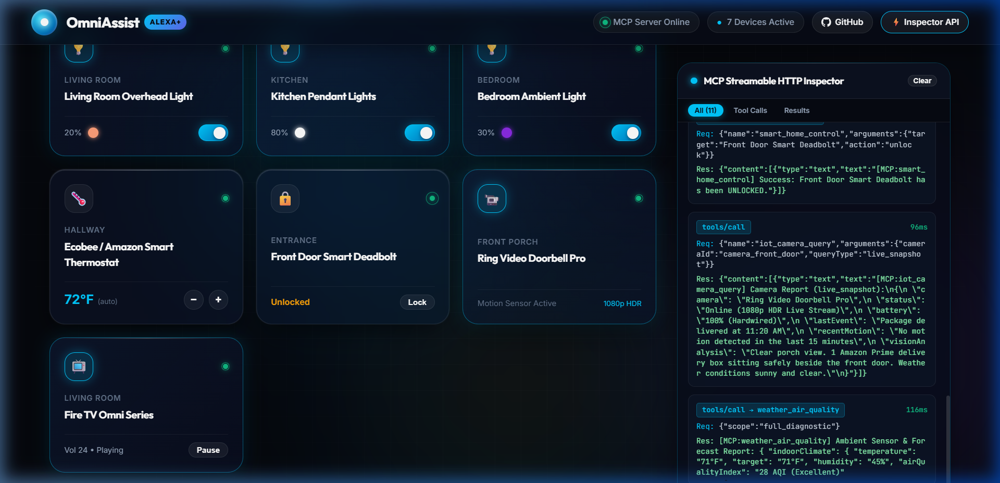
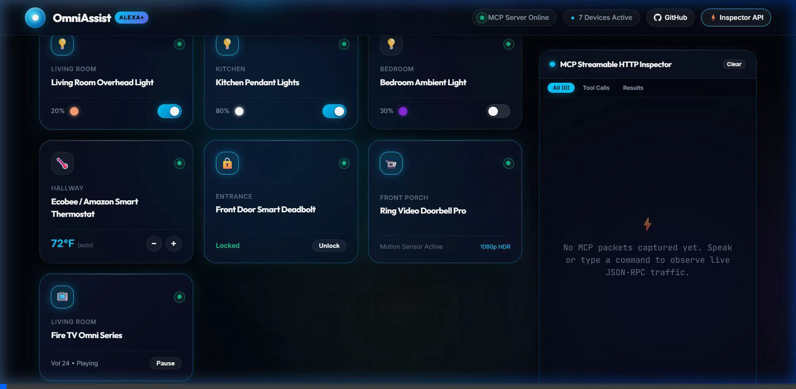
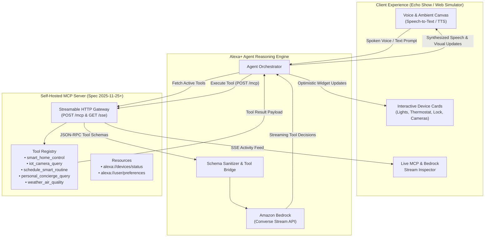

# 🌟 OmniAssist Alexa+ (Next-Gen Autonomous Concierge)

[](https://amazonappdev2026.devpost.com/)
[](https://modelcontextprotocol.io/)
[](https://aws.amazon.com/bedrock/)
[](LICENSE)
[](https://github.com/Divyanshu-Kumar-Dubey/alexa-plus-omniassist/actions/workflows/ci.yml)
[](docker-compose.yml)

> Built for the **Build, Ship, Shape: Amazon Developer Hackathon 2026** on Devpost.  
> **Primary Track:** Alexa+ | **Mini-Challenges:** AWS Builder & Open Source | **Bonus:** Friction Logs Included.

---

## 🎥 Visual Demo & Walkthrough

<p align="center">
  
</p>

<p align="center">
  <em>Live interactive simulation running with Glassmorphism 2.0, dynamic Alexa halo ring, audio visualizer, real-time IoT controls, and Streamable HTTP MCP Inspector.</em>
</p>

<p align="center">
  
</p>

---

## 🎯 Vision & Overview

**OmniAssist Alexa+** is a complete, production-ready implementation of the next-generation **Alexa+** conversational assistant. Powered by open standards, it merges:
1. **Self-Hosted Model Context Protocol (MCP) Server**: Full implementation of the `2025-11-25` specification over **Streamable HTTP transport**, exposing rich tools, contextual resources, and prompt templates for ambient smart home, IoT, scheduling, and device orchestration.
2. **AWS Bedrock Intelligence Core**: Autonomous multi-step reasoning, dynamic tool selection, and low-latency token streaming backed by Amazon Bedrock (Claude 3.5 Sonnet / AWS Nova).
3. **Simulated Alexa+ Multimodal Canvas**: An ambient, dark glassmorphic web dashboard (resembling Echo Show / Fire TV) with real-time audio waveform visualization, speech-to-text, optimistic device state updates, and an interactive MCP tool inspector.

---

## 🏗️ System Architecture



---

## ✨ Core Features

- 🎙️ **Voice & Ambient Multimodal Interaction**: Speak directly to Alexa+ or type natural language prompts. Visual audio waveform responds dynamically to speech input and voice synthesis.
- ⚡ **Full Streamable HTTP MCP Server**: Implements JSON-RPC 2.0 requests over chunked HTTP and Server-Sent Events (SSE) compliant with the latest MCP standard (`2025-11-25`).
- 🏠 **Rich Smart Device Ecosystem**: Control lights (brightness & RGB color), HVAC thermostats, smart deadbolts, simulated Ring security feeds, and routine automations.
- 🧠 **Dual-Mode AI Engine**:
  - **Live AWS Bedrock Mode**: Direct integration with `@aws-sdk/client-bedrock-runtime` for cloud inference.
  - **Embedded Autonomous Simulator**: Runs flawlessly out-of-the-box with deterministic tool execution for instant demonstration without requiring cloud API keys.
- 🛠️ **Real-Time MCP Inspector**: Live console inside the UI that shows every MCP request, tool invocation, arguments, and latency in milliseconds.
- 📝 **Friction Log & Bonus Report**: Full analysis of developer experience to claim the official **up to 10% judging bonus**.

---

## 📂 Repository Structure

```
alexa-plus-omniassist/
├── LICENSE                        # Open-source MIT License
├── README.md                      # Complete system documentation
├── friction-log.md                # Hackathon bonus: Developer friction log
├── product-feedback.md            # Required Devpost feedback write-up
├── server/                        # Self-Hosted MCP Server (TypeScript / Node)
│   ├── src/
│   │   ├── index.ts               # Server bootstrap & Express/HTTP setup
│   │   ├── mcpProtocol.ts         # JSON-RPC 2.0 & Streamable HTTP implementation
│   │   ├── tools.ts               # Smart Home, IoT & Concierge tool definitions
│   │   └── state.ts               # In-memory virtual IoT state engine
│   ├── package.json
│   └── tsconfig.json
└── web/                           # Alexa+ Multimodal Simulation UI (Vite + React)
    ├── src/
    │   ├── components/            # Echo Show ambient cards, waveform, inspector
    │   ├── hooks/                 # Speech synthesis, voice recognition, MCP client
    │   ├── services/              # MCP Streamable HTTP client & Bedrock bridge
    │   ├── App.tsx                # Main canvas view
    │   ├── index.css              # Dark Glassmorphism Design System
    │   └── main.tsx
    ├── index.html
    ├── package.json
    └── vite.config.ts
```

---

## 🚀 Quick Start Guide

### Option A: One-Command Docker Setup (Recommended)
Launch both the Self-Hosted MCP Server and the Alexa+ Web Simulator simultaneously:
```bash
docker compose up --build
```
- Alexa+ Ambient Web Simulator: `http://localhost:5173`
- Self-Hosted MCP Server: `http://localhost:3001` (`/mcp`, `/sse`, `/health`)

### Option B: Local Node.js Development

#### Prerequisites
- **Node.js**: v18.0.0 or higher (v20+ recommended)
- **npm**: v9+

#### 1. Install & Launch the MCP Server
```bash
cd server
npm install
npm run build
npm start
```
The server will start on `http://localhost:3001` with:
- `POST /mcp` - Streamable HTTP JSON-RPC endpoint
- `GET /sse` - Server-Sent Events endpoint
- `GET /health` - Interactive glassmorphic diagnostics dashboard & tool summary

#### 2. Install & Launch the Alexa+ Web Simulator
In a new terminal:
```bash
cd web
npm install
npm run dev
```
Open `http://localhost:5173` in your browser.

---

## 💬 Example Voice / Text Commands to Try

- *"Alexa, good morning. Turn on the kitchen lights to 80% warm white and set the thermostat to 72 degrees."*
- *"Alexa, check the front door Ring camera and see if anyone is outside."*
- *"Alexa, activate Movie Night mode and lock the front door."*
- *"Alexa, what is the air quality and temperature in the living room?"*
- *"Alexa, schedule a reminder for the Amazon Hackathon demo at 2 PM."*

---

## 🏆 Hackathon Alignment & Scoring Matrix

| Criteria | How OmniAssist Excels |
| :--- | :--- |
| **Tech Implementation** | Production-ready MCP Server over Streamable HTTP (`spec 2025-11-25`), cleanly decoupled tool execution, and Bedrock Converse stream tool-calling. |
| **Design & UX** | Stunning Echo Show ambient interface with dark glassmorphism, glowing Alexa cyan ring, live animated audio waveform, and instant optimistic feedback. |
| **Potential Impact** | Solves the real-world fragmentation in smart home automation by providing a unified, open-standard conversational agent bridge. |
| **Quality of Idea** | Pioneers the shift from rigid, hardcoded voice skills to autonomous agentic reasoning using the Model Context Protocol. |
| **Friction Log Bonus** | Comprehensive 3-part friction log with severity ratings, code workarounds, and concrete recommendations for the Amazon Developer team. |

---

## 📚 Hackathon Submission Documents & Artifacts

- 📋 [**Devpost Submission Copy (`devpost-submission.md`)**](devpost-submission.md) - Complete, ready-to-paste Devpost text fields, elevator pitch, architecture breakdown, and 3-minute video script.
- 🪵 [**Friction Log & Dev Experience Report (`friction-log.md`)**](friction-log.md) - Deep-dive into MCP Streamable HTTP nuances, Bedrock schemas, and audio-visual sync (claiming the up to 10% judging bonus).
- 📝 [**Product Feedback Report (`product-feedback.md`)**](product-feedback.md) - Mandatory Devpost feedback on MCP, Amazon Bedrock, and Devices Builder tools.

---

## 👥 Team & Submission Details

- **Author / Developer:** [Divyanshu Kumar Dubey (Ansh Dubey)](https://github.com/Divyanshu-Kumar-Dubey)
- **Repository:** [https://github.com/Divyanshu-Kumar-Dubey/alexa-plus-omniassist](https://github.com/Divyanshu-Kumar-Dubey/alexa-plus-omniassist)
- **Hackathon:** [Build, Ship, Shape: Amazon Developer Hackathon 2026](https://amazonappdev2026.devpost.com/)
- **Submission Track:** Alexa+ (Primary) | AWS Builder & Open Source (Mini Challenges)

---

## 📄 License

This project is licensed under the [MIT License](LICENSE) - open and free for the global developer community.

